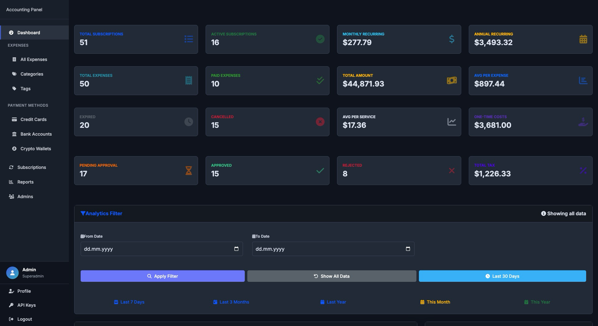
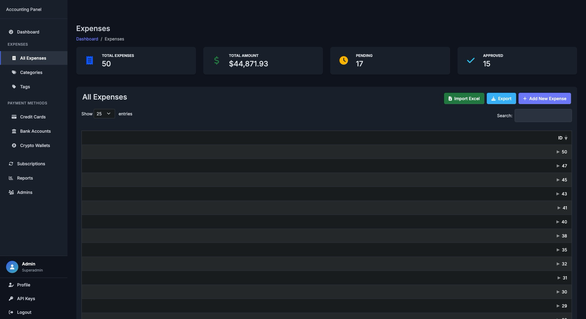
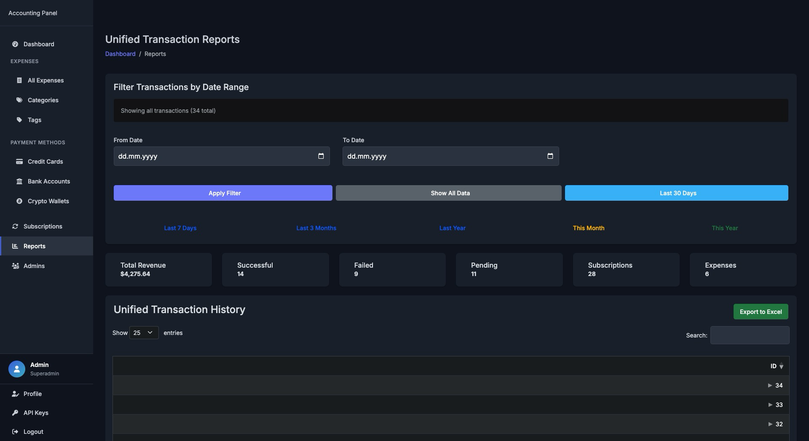
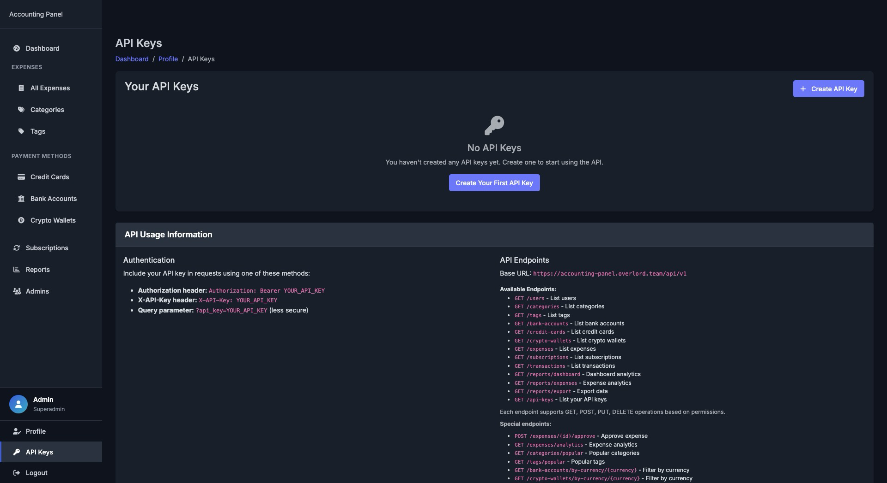

# PersonalAccounter

A comprehensive PHP-based personal and business accounting management system with powerful expense tracking, subscription management, and reporting capabilities.

# Auto Deploy
Accounting Panel Docker Setup Script
Production-ready automated deployment with secure configuration

Usage:
```bash
   curl -fsSL https://raw.githubusercontent.com/moonshadowrev/PersonalAccounter/main/setup.sh | bash
```
```bash
   wget -qO- https://raw.githubusercontent.com/moonshadowrev/PersonalAccounter/main/setup.sh | bash
```

# Quick install 
```bash
git clone https://github.com/moonshadowrev/PersonalAccounter
cd PersonalAccounter
bash ./setup.sh
```

## 🌟 Features

### 💰 **Expense Management**
- **Multi-method expense tracking** with support for credit cards, bank accounts, and cryptocurrency wallets
- **Smart categorization** with tags and hierarchical organization
- **Tax calculation** with customizable rates and types
- **Approval workflow** with pending/approved/rejected/paid status tracking
- **File attachments** for receipts and documentation
- **Bulk import/export** via Excel, CSV, and JSON formats

### 🔄 **Subscription Management**
- **Recurring subscription tracking** for all your services and subscriptions
- **Flexible billing cycles**: monthly, annual, weekly, daily, and one-time payments
- **Multi-currency support** with automatic calculations
- **Status management**: active, expired, cancelled, paused
- **Cost projections** and spending analysis

### 💳 **Payment Methods**
- **Credit Cards**: Full card management with bank association and currency support
- **Bank Accounts**: International banking with IBAN, SWIFT/BIC, and routing number support
- **Crypto Wallets**: Multi-network cryptocurrency wallet management with address validation

### 📊 **Analytics & Reporting**
- **Real-time dashboard** with comprehensive financial statistics
- **Visual analytics** with charts and graphs for spending patterns
- **Date-filtered reports** for any time period
- **Export capabilities** in multiple formats (CSV, JSON, Excel)
- **Category and payment method breakdowns**

### 🔐 **Security & Authentication**
- **Two-Factor Authentication (2FA)** with Google Authenticator support
- **User role management** (admin, superadmin)
- **API key management** with permission-based access control
- **CSRF protection** and security headers
- **Session security** with configurable timeouts

### 🚀 **API & Integration**
- **RESTful API** with OpenAPI/Swagger documentation
- **Authentication** via API keys or Bearer tokens
- **Rate limiting** and comprehensive error handling
- **Webhooks support** for external integrations
- **Comprehensive endpoints** for all application features

## 📸 Screenshots

### Main Dashboard

*Comprehensive financial overview with real-time statistics, recent transactions, and spending analytics*

### Expense Management

*Intuitive expense tracking interface with category management, bulk operations, and advanced filtering*

### Financial Reports & Analytics

*Detailed financial reports with visual charts, spending patterns, and exportable data insights*

### Account & Settings Management

*User management, security settings, API configuration, and system administration tools*

## 📋 Requirements

- **PHP**: 8.0 or higher
- **MySQL**: 5.7 or higher
- **Web Server**: Apache or Nginx
- **Composer**: For dependency management

### PHP Extensions Required
- `pdo_mysql`
- `json`
- `openssl`
- `mbstring`
- `gd`
- `curl`
- `zip`

## 🚀 Installation

### 1. Clone the Repository
```bash
git clone https://github.com/moonshadowrev/PersonalAccounter
cd PersonalAccounter
```

### 2. Install Dependencies
```bash
composer install
```

### 3. Environment Configuration
```bash
cp .env.example .env
```

Edit the `.env` file with your configuration:
```env
# Application
APP_ENV=production
APP_DEBUG=false
APP_URL=https://your-domain.com
APP_DOMAIN=your-domain.com
APP_TIMEZONE=UTC

# Database
DB_HOST=localhost
DB_NAME=personal_accounter
DB_USER=your_username
DB_PASS=your_password
DB_PORT=3306

# Security
SESSION_LIFETIME=0
SESSION_SECURE=true
SESSION_SAMESITE=Lax
LOGIN_ATTEMPTS_LIMIT=5
LOGIN_ATTEMPTS_TIMEOUT=300

# API
API_MAX_FAILED_ATTEMPTS=5
API_BLOCK_DURATION=300
API_DEFAULT_RATE_LIMIT=60
API_MAX_RATE_LIMIT=1000

# Logging
LOG_CHANNEL=file
LOG_LEVEL=warning
LOG_MAX_FILES=5
```

### 4. Database Setup
```bash
# Run migrations
php control migrate run

# Create admin user
php control user admin

# Seed with sample data (optional)
php control db seed
```

### 5. File Permissions
```bash
chmod 755 -R .
chmod 777 -R logs/
chmod 777 -R sessions/
chmod 777 -R public/uploads/
```

### 6. Web Server Configuration

#### Apache (.htaccess)
```apache
RewriteEngine On
RewriteCond %{REQUEST_FILENAME} !-f
RewriteCond %{REQUEST_FILENAME} !-d
RewriteRule ^(.*)$ public/index.php [QSA,L]
```

#### Nginx
```nginx
location / {
    try_files $uri $uri/ /public/index.php?$query_string;
}

location ~ \.php$ {
    fastcgi_pass unix:/var/run/php/php8.0-fpm.sock;
    fastcgi_param SCRIPT_FILENAME $realpath_root$fastcgi_script_name;
    include fastcgi_params;
}
```

## 🎯 Quick Start

### 1. Access the Application
Navigate to `https://your-domain.com` and log in with your admin credentials.

### 2. Setup Payment Methods
1. Go to **Payment Methods** → **Bank Accounts**
2. Add your bank account information
3. Add credit cards and crypto wallets as needed

### 3. Create Categories
1. Go to **Expenses** → **Categories**
2. Create categories for your expense types (Food, Transport, Utilities, etc.)
3. Use the "Create Defaults" button to add common categories

### 4. Start Tracking Expenses
1. Go to **Expenses** → **All Expenses**
2. Click "Add Expense"
3. Fill in the details and submit

### 5. Setup Subscriptions
1. Go to **Subscriptions**
2. Add your recurring services and subscriptions
3. Set billing cycles and amounts

## 📱 Usage

### Managing Expenses
- **Create**: Add new expenses with detailed information including tax calculations
- **Categorize**: Organize expenses using categories and tags
- **Approve**: Use the approval workflow for business expense management
- **Import**: Bulk import expenses from Excel or CSV files
- **Export**: Generate reports in various formats

### Subscription Tracking
- **Add Services**: Track all your recurring subscriptions
- **Monitor Costs**: View monthly and annual cost projections
- **Status Management**: Mark subscriptions as active, paused, expired, or cancelled
- **Billing Cycles**: Support for various billing frequencies

### Financial Reporting
- **Dashboard**: View comprehensive financial overview
- **Date Filtering**: Generate reports for specific time periods
- **Visual Analytics**: Charts and graphs for spending patterns
- **Export Options**: CSV, JSON, and Excel format exports

## 🔧 Command Line Interface

The application includes a powerful CLI tool:

```bash
# Database migrations
php control migrate run
php control migrate fresh
php control migrate rollback
php control migrate status

# User management
php control user create "John Doe" "john@example.com" "password" "admin"
php control user list
php control user delete "john@example.com"
php control user admin

# Database operations
php control db seed
php control db reset
php control db status

# Fake data generation
php control faker all
php control faker generate --users=10 --expenses=100
```

## 🔌 API Usage

### Authentication
```bash
# Get API key from Profile → API Keys in the web interface
curl -H "X-API-Key: your-api-key" https://your-domain.com/api/v1/expenses
```

### Example API Calls
```bash
# Get all expenses
curl -H "X-API-Key: your-key" https://your-domain.com/api/v1/expenses

# Create an expense
curl -X POST -H "X-API-Key: your-key" \
  -H "Content-Type: application/json" \
  -d '{"title":"Lunch","amount":25.50,"category_id":1}' \
  https://your-domain.com/api/v1/expenses

# Get dashboard statistics
curl -H "X-API-Key: your-key" https://your-domain.com/api/v1/reports/dashboard
```

### API Documentation
Access the interactive API documentation at:
- **Swagger UI**: `https://your-domain.com/api/docs/ui` (development mode only)
- **OpenAPI JSON**: `https://your-domain.com/api/docs` (development mode only)

## 🏗️ Architecture

### Directory Structure
```
PersonalAccounter/
├── app/
│   ├── Controllers/        # Application controllers
│   ├── Models/            # Database models
│   ├── Services/          # Business logic services
│   ├── Routes/            # Route definitions
│   └── Views/             # Template files
├── bootstrap/             # Application bootstrap
├── config/               # Configuration files
├── database/             # Database migrations
├── logs/                 # Application logs
├── public/               # Web accessible files
├── sessions/             # Session storage
└── vendor/               # Composer dependencies
```

### Technology Stack
- **Backend**: PHP 8.0+ with custom MVC framework
- **Database**: MySQL with Medoo ORM
- **Frontend**: HTML5, CSS3, JavaScript (Vanilla JS)
- **Authentication**: Custom session-based auth with 2FA
- **API**: RESTful with OpenAPI documentation
- **Security**: CSRF protection, XSS prevention, input validation

## 🌍 Localization

The application supports multiple currencies and international banking:
- **Currencies**: USD, EUR, GBP, CAD, AUD, JPY, CHF, CNY, SEK, NOK, DKK, SGD, HKD
- **Banking**: IBAN and SWIFT/BIC support for international accounts
- **Crypto**: Multi-network cryptocurrency support

## 🛡️ Security

PersonalAccounter implements comprehensive security measures:
- **CSRF Protection**: All forms protected against cross-site request forgery
- **XSS Prevention**: Input sanitization and output encoding
- **SQL Injection**: Prepared statements and parameterized queries
- **Session Security**: Secure cookie settings and session regeneration
- **Rate Limiting**: API and login attempt limitations
- **Security Headers**: HSTS, content type options, frame options
- **Two-Factor Authentication**: Google Authenticator integration

## 📖 Documentation

For detailed documentation including:
- **API Reference**: Complete endpoint documentation
- **Security Guide**: Security implementation details
- **Contribution Guidelines**: How to contribute to the project
- **Feature Wiki**: Detailed feature documentation

See the [`docs/`](./docs/) directory.

## 📄 License

This project is licensed under the GNU General Public License v3.0 (GPL-3.0).

See [LICENSE](LICENSE) for the full license text.

## 🤝 Contributing

We welcome contributions! Please see [CONTRIBUTING.md](CONTRIBUTING.md) for guidelines.

## 🐛 Issues & Support

- **Bug Reports**: [GitHub Issues](https://github.com/your-repo/PersonalAccounter/issues)
- **Feature Requests**: [GitHub Discussions](https://github.com/your-repo/PersonalAccounter/discussions)
- **Security Issues**: See [SECURITY.md](SECURITY.md)

## 🔄 Changelog

See [CHANGELOG.md](CHANGELOG.md) for version history and changes.

---

**PersonalAccounter** - Take control of your finances with powerful, secure, and flexible accounting management. 
